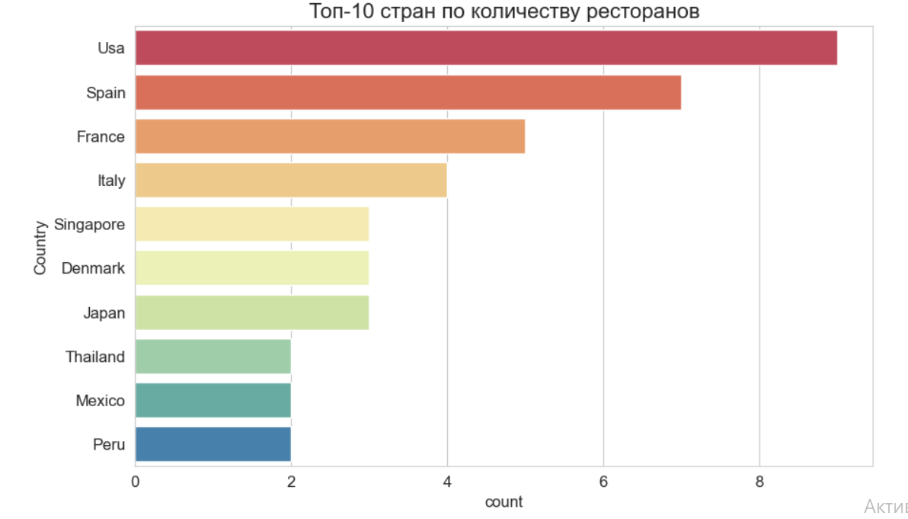
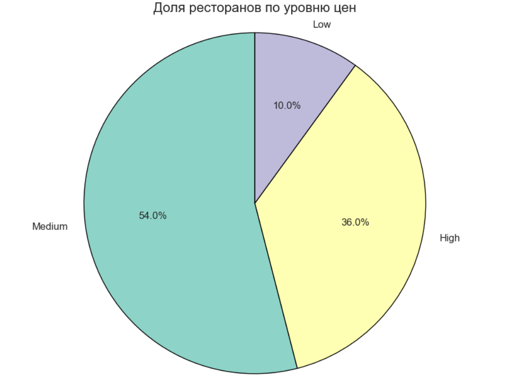
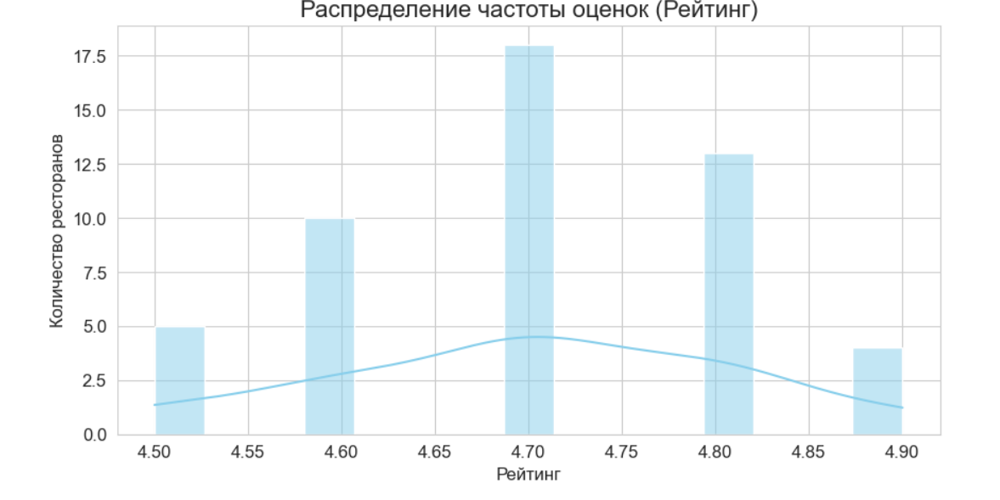
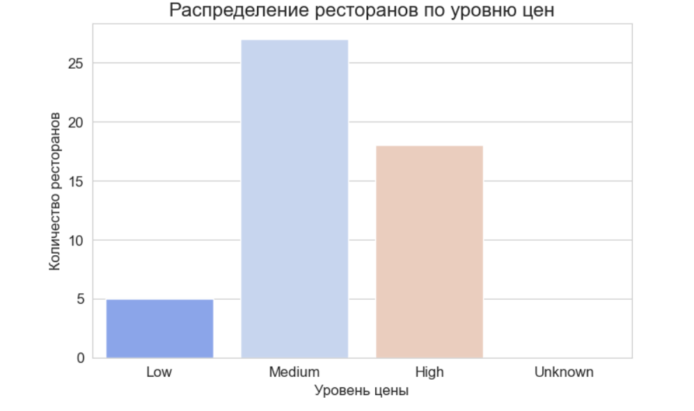
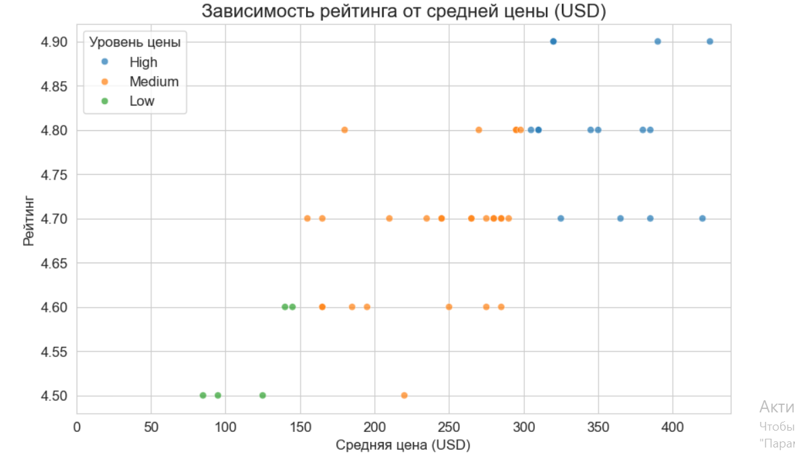
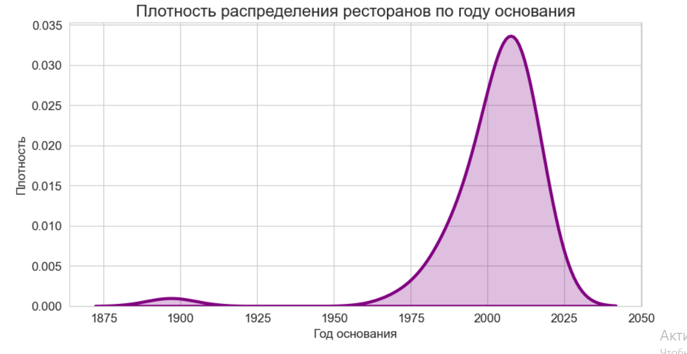

# top_world_restaurants_analysis
Анализ датасета топовых ресторанов мира
# 1. Резюме проекта
Данный проект посвящён анализу датасета «Top World Restaurants», включающего информацию о лучших ресторанах мира: страна, кухня, цены, рейтинги и другие характеристики. Данные предоставлены для сдачи экзамена в AlmaU.
# 2. Бизнес-задачи:
1)В каких странах находится больше всего топовых ресторанов?
2)Какие кухни наиболее популярны среди них?
3)Какие ниболее частые оценки?
4)У каких стран самый высокий средний рейтинг?
5)Как распределены рестораны по уровням цен?
6)Как количество типов кухни влияет на рейтинг?
7)Как распределяются рейтинги ресторанов?
# 3. Графики и код
Файл с кодом: [Открыть Juputer Notebook](https://github.com/sofia19pe/top_world_restaurants_analysis/blob/main/Untitled_%D1%81%D0%BE%D1%84%D0%B8%D1%8F.ipynb)**

График №1. График показывает в каких странах находится наибольшее число топовых ресторанов.

График №2. График демонстрирует процентное соотношение ресторанов, распределенных по ценовым категориям (Low, Medium, High, Unknown).

График №3. Гистограмма показывает, как часто встречаются те или иные числовые рейтинги. Но рейтинги топовых ресторанов сосредоточены в очень узком, высоком диапазоне. Можно уыидеть есть ли сдвиг в сторону идеальной оценки (5.0).

График №4. Сравнивает средний рейтинг среди стран, которые имеют наибольшее количество ресторанов.

График №5. Диаграмма показывает, сколько ресторанов попали в каждую из трех ценовых категорий, определенных на основе средней цены.

График №6. Диаграмма показывает плотность распределения рейтингов в зависимости от цены. У более дорогих ресторанов (High) рейтинги более плотно сгруппированы у верхних значений.

График №7. Показывает, какие типы кухни чаще всего встречаются в списке топовых ресторанов.

График №8. Диаграмма рассеяния показывает каждую точку данных (ресторан) по его цене и рейтингу.

График №9. Показывает, в какие годы было основано больше всего ресторанов из данного списка.

График №10. Сравнивает средний рейтинг ресторанов, сгруппированных по континентам.

